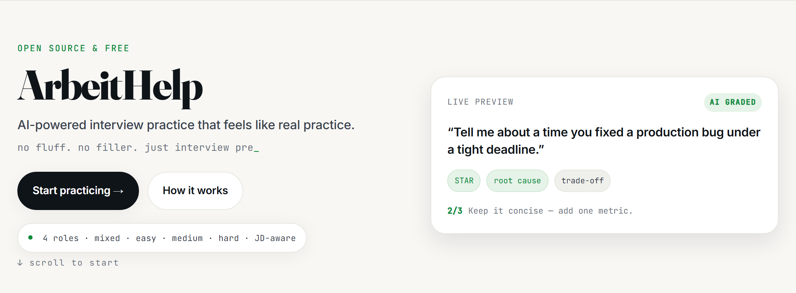
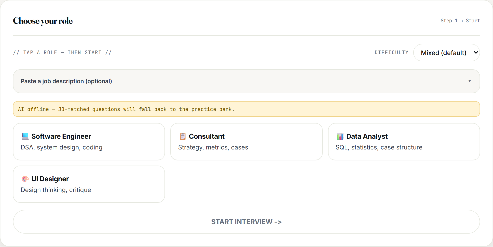
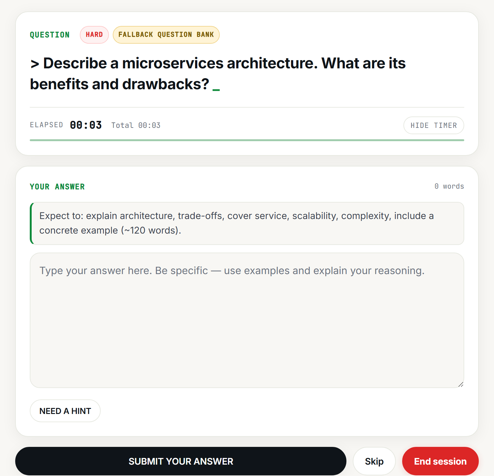
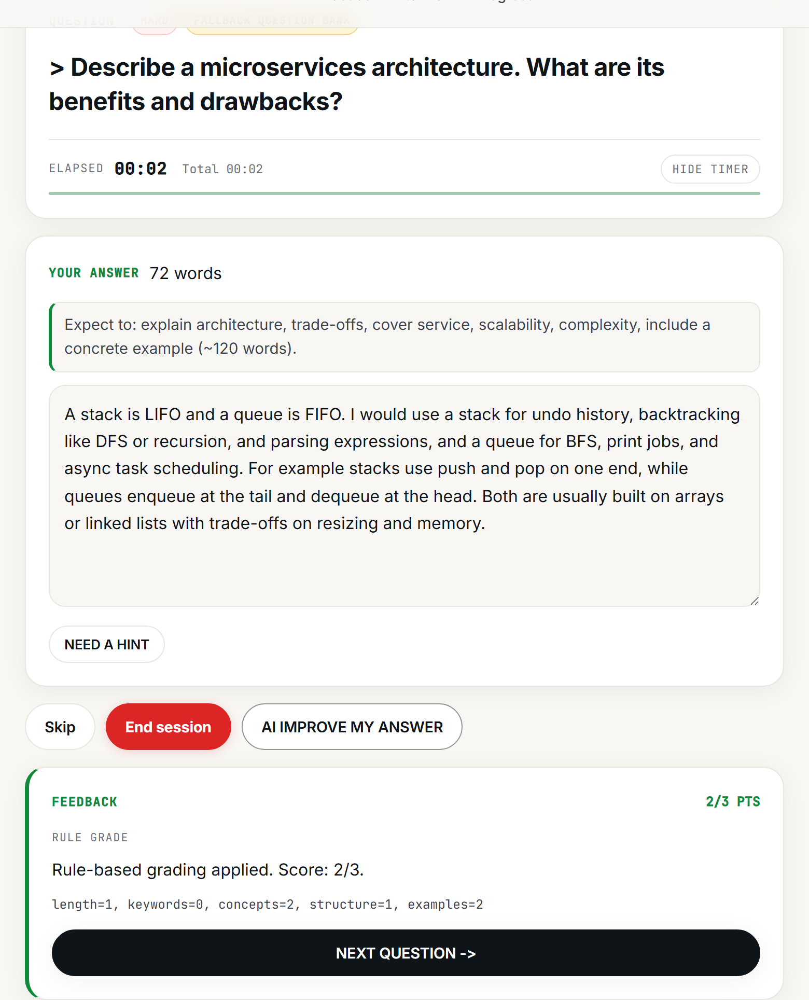
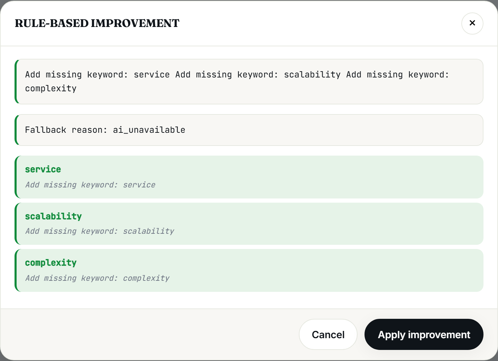
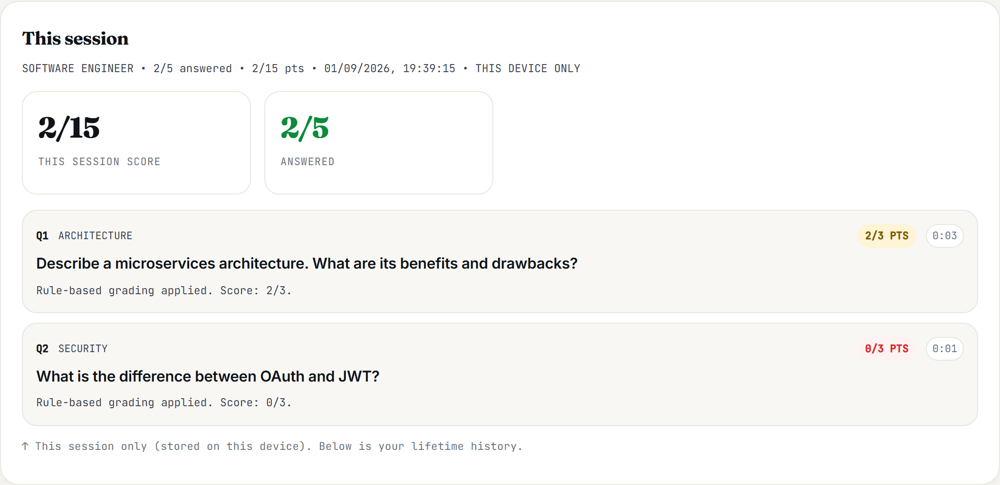
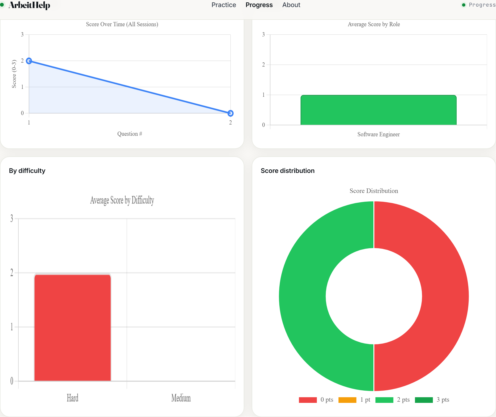
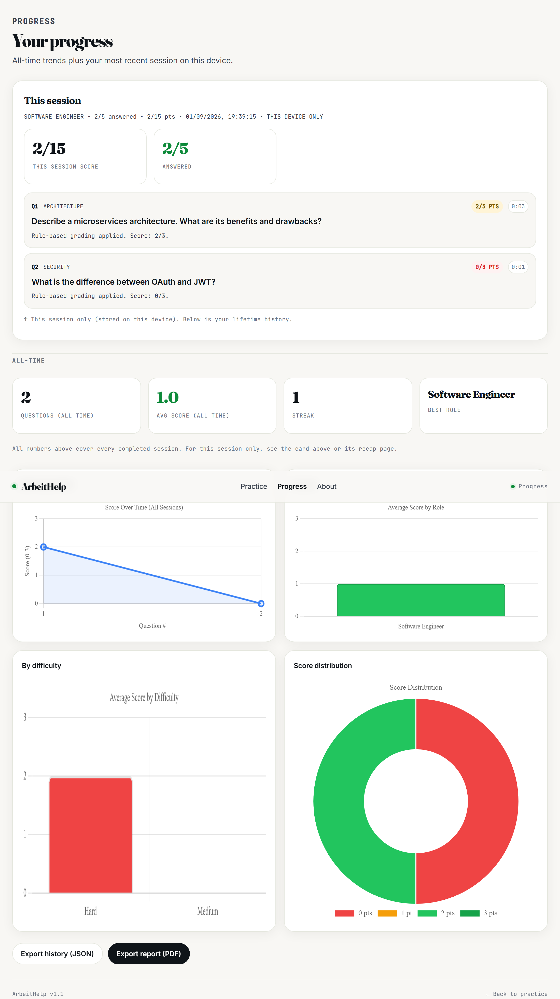

# ArbeitHelp

**AI-powered interview practice. No fluff. No paywalls. Just the questions that actually get asked.**

ArbeitHelp is a free, open-source web app that helps you practice for job interviews without pretending a textbook is fun. Pick a role, answer real interview questions, get graded instantly (0–3, no sugar-coating), improve weak answers on the spot, and track your progress over time. It works with AI on or off  so you can practice even when the robots are down.

<p align="center">
  
</p>

---

## Features

- **Choose your role** — Software Engineer, Consultant, Data Analyst, or UI Designer. Each comes with a curated question bank and AI-generated variants. Or paste a job description and bring your own role (up to 80 characters, we trim the rambling).
- **Difficulty that means something** — `Mixed` (default), `Easy`, `Medium`, `Hard`. Easy questions are actually short; hard ones actually make you think. Validated, not wishful thinking.
- **Job-description-aware** — paste a JD, hit *Analyze*, and questions are weighted toward its skills and focus areas. If AI is offline, you get the honest fallback: "bank only, no JD magic."
- **Instant grading, not instant flattery** — 0–3 per answer with feedback and a breakdown (`length / keywords / concepts / structure / examples`). Uses AI when available, falls back to deterministic rules. A hint caps that question at 2/3 — because hints should cost something.
- **Hints and model answers** — stuck? Ask for a nudge. Curious what "good" looks like? Check the model answer. Both cache after the first call.
- **AI-improved answers** — not happy with your answer? Ask the AI to rewrite it and see a before/after diff. Apply it or keep your version — your interview, your voice.
- **Elapsed timer, not a countdown bomb** — per-question `Elapsed 00:03` plus `Total 00:03`. Hide it if it stresses you out. Avg time per question lives only in the recap, not everywhere.
- **Skip, end early, copy recap** — skip questions, end a session early (with confirmation), and copy the session summary to clipboard for later embarrassment or celebration.
- **Progress that respects your time** — stats split cleanly: *This session* (on this device, via `localStorage`) vs *All-time* (lifetime history from SQLite). Four charts, weakest topics, streak, best role.
- **Export** — JSON for the data-minded, PDF (`fpdf2`) for the manager-reading crowd.

---

## How it works

1. **Pick your role and difficulty** — choose a tile, set difficulty, optionally paste a JD and run *Analyze* (`AI online` means signals were found; `AI offline` tells you upfront).

<p align="center">
  
</p>

*Tap a role, then start. The button stays politely disabled until you do.*

2. **Answer and get graded** — you'll see an expectation hint (`Expect to: explain architecture, trade-offs, cover service/scalability/complexity, include a concrete example (~120 words)`), a live word count, and a timer that counts up because interviews count up, not down.

<p align="center">
  
</p>

*Timer: elapsed per question + total session. No auto-skip. You control the pace.*

3. **Iterate or move on** — submit, see your score (e.g. `2/3 PTS` with breakdown), try *AI improve*, check the model answer, or hit *Next*. Average time appears only after you submit, and only in the recap.

<p align="center">
  
</p>

*Rule-based fallback is honest when AI is napping: "Rule-based grading applied."*

**Optional detour:** after a submission, *AI IMPROVE MY ANSWER* opens a diff modal. Green means added, gray means replaced. The fallback still adds the missing keywords, just without the poetry.

<p align="center">
  
</p>

*Missing "service, scalability, complexity"? The diff will remind you, gently.*

---

## Tech stack

- **Backend:** Python, [Flask](https://flask.palletsprojects.com/)
- **Database:** SQLite (`data/app_data.sqlite3`, with `_migrate_db()` for `attempts`/`sessions` columns)
- **Auth:** JWT ([PyJWT](https://pyjwt.readthedocs.io/)), hashed passwords, `Authorization` / `Authorisation` headers, `Authorisation` kept for test compatibility
- **AI provider:** [Groq](https://groq.com/) via `ai_teacher.py` (circuit breaker, timeouts, usage metadata) — model `openai/gpt-oss-120b` by default, swappable via `AI_PROVIDER`/`AI_MODEL` in `config.py`
- **Prompts:** external versioned files in `prompts/` (`v1.0_system.txt`, `v1.0_question_generator.txt`, `v1.0_hint.txt`, `v1.0_jd_parser.txt`)
- **PDF export:** [fpdf2](https://pyfpdf.github.io/fpdf2/)
- **Frontend:** plain HTML/CSS/JS — no framework, no build step. Shared tokens and nav in `common.css`/`common.js`, page styles in `style.css` / `questions.css` / `stats.css`
- **Server:** `gunicorn app:app` (prod), `python app.py` (dev at `http://localhost:5050`)
- **Testing:** `pytest` (route + workflow coverage, no Groq key required)

## Getting started

### Prerequisites

- Python 3.12+
- A [Groq API key](https://console.groq.com/) (optional — the app runs with AI disabled and falls back to `data/questions.json` + deterministic grading)

### Installation

```bash
# Clone the repo
git clone https://github.com/<your-username>/ArbeitHelp.git
cd ArbeitHelp

# Create a virtual environment
python -m venv venv
source venv/bin/activate   # Windows: venv\Scripts\activate

# Install dependencies
pip install -r requirements.txt
```

### Configuration

Copy the example environment file and fill in your values:

```bash
cp .env.example .env
```

| Variable         | Description                                                                      | Default                 |
| ---------------- | -------------------------------------------------------------------------------- | ----------------------- |
| `GROQ_API_KEY` | Your Groq API key (required for live AI features)                                | —                      |
| `GROQ_MODEL`   | Groq model used for question generation and grading                              | `openai/gpt-oss-120b` |
| `AI_ENABLED`   | Set to`true` to enable AI features                                             | `false`               |
| `AI_TIMEOUT`   | Timeout (seconds) for AI requests                                                | `30`                  |
| `JWT_SECRET`   | Secret used to sign auth tokens (auto-generated in`data/.jwt_secret` if unset) | —                      |

AI-disabled behavior is intentional — the static bank, rule-based grading, and fallback hints keep the app usable without keys.

### Run locally

```bash
python app.py
```

The app will be available at `http://localhost:5050`.

For production:

```bash
gunicorn app:app
```

### Run tests

```bash
pytest
```

Tests use a temporary SQLite DB and disable AI via `tests/conftest.py`.

## Project structure

```
ArbeitHelp/
├── app.py                  # Flask routes, auth, sessions, SQLite + migrations
├── ai_teacher.py           # Groq calls, prompt loading, parsing, timeouts, fallbacks
├── config.py               # Env-backed settings and repo paths (AI_PROVIDER, etc.)
├── data/
│   ├── questions.json      # Fallback question bank (4 roles, 65+ questions)
│   └── app_data.sqlite3    # SQLite database (users, sessions, attempts) — don't commit
├── prompts/                # Versioned AI prompts (v1.0_system, question_generator, hint, jd_parser)
├── static/
│   ├── common.css / common.js   # Shared tokens, nav, focus, helpers
│   ├── index.html / style.css / script.js
│   ├── questions.html / questions.css / questions.js
│   ├── stats.html / stats.css / stats.js
│   └── favicon.svg
├── image/README/           # Screenshots used here
├── tests/                  # Pytest suite
└── requirements.txt
```

## Screens — what it actually looks like

**1. Hero + live preview** — the typewriter still types `no fluff. no filler.` and the live preview pretends to be helpful (it is).

**2. Launcher** — see above. Difficulty on the right, JD slot in the middle, four roles that cover 80% of job ads.

**3. Question** — elapsed per question + total, expectation hint, word count, *NEED A HINT* (caps at 2/3 if you peek), red *End session* for when you've had enough.

**4. Feedback** — score, whether it was `RULE GRADE` or `AI GRADE`, and a breakdown you can argue with but not ignore.

**5. Recap + last-session stats** — after 5 questions (or *End session*) you get a recap with copyable text and per-question `0:03` pills. *This session* cards live above the lifetime charts.

<p align="center">
  
</p>

*This session only, stored on this device. The lifetime charts don't lie either, but they're below.*

## Stats & progress dashboard

Once you finish a session, ArbeitHelp shows all-time trends: total answered, average score, streak (consecutive days with a completed session), best role, weakest topics (avg by topic, min 2 answers), plus four charts — score over time, by role, by difficulty, score distribution. Export JSON or PDF any time.

<p align="center">
  
</p>

*If you see a red donut, that's not a design choice. That's your 0/3s.*

<p align="center">
  
</p>

*An alternative full-page view — same data, fewer scrolls.*

## API sketch

| Method   | Path                                                                                             | Notes                                                                                                  |
| -------- | ------------------------------------------------------------------------------------------------ | ------------------------------------------------------------------------------------------------------ |
| `POST` | `/auth/signup`, `/auth/login`, `GET /auth/me`                                              | JWT in`Authorization` / `Authorisation: Bearer <token>`                                            |
| `POST` | `/jd/preview`                                                                                  | Extract JD signals (skills/tools/focus/seniority)                                                      |
| `POST` | `/session/start`                                                                               | `role`, `difficulty` (`mixed/easy/medium/hard`), optional `job_description`                    |
| `GET`  | `/session/question`                                                                            | Resume or generate next (AI → fallback bank,`fallback_no_jd_match` when JD requested but bank used) |
| `POST` | `/session/submit`                                                                              | Body`answer` + `elapsed_seconds` (used for avg in recap)                                           |
| `POST` | `/session/skip` , `/session/end`, `/session/hint`, `/session/model-answer`, `/correct` | Skip, finalize, hint, model answer, AI improvement                                                     |
| `GET`  | `/stats/unlock-status`, `/stats/summary`, `/stats/chart-data`, `/stats/export/*`         | Locked until 1 answered; charts + PDF/JSON                                                             |
| `GET`  | `/health`, `/roles`                                                                          | Health includes`ai_enabled`, `provider`, model, prompt versions, roles, totals                     |

Full route contracts in `app.py:627-1317`.

## Roadmap ideas

- More roles and question packs (you can already PR `data/questions.json`)
- Adaptive difficulty (you do badly on hard → we notice)
- Richer JD matching and per-topic drills
- A nicer "you're done" confetti. Or not. Interviews have no confetti.

## Contributing

Issues and PRs welcome. Keep tests hermetic, don't commit `data/app_data.sqlite3` or `.env`, and keep the AI-disabled path working cause it's a feature, not a fallback apology.

## License

This project is open source and free to use. 

---
