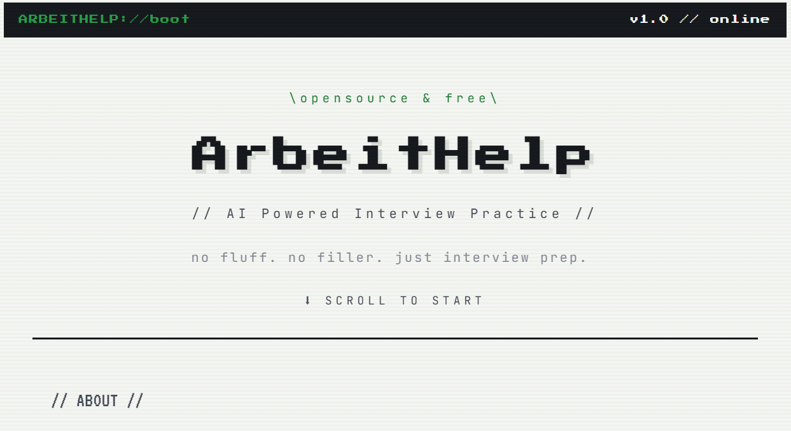
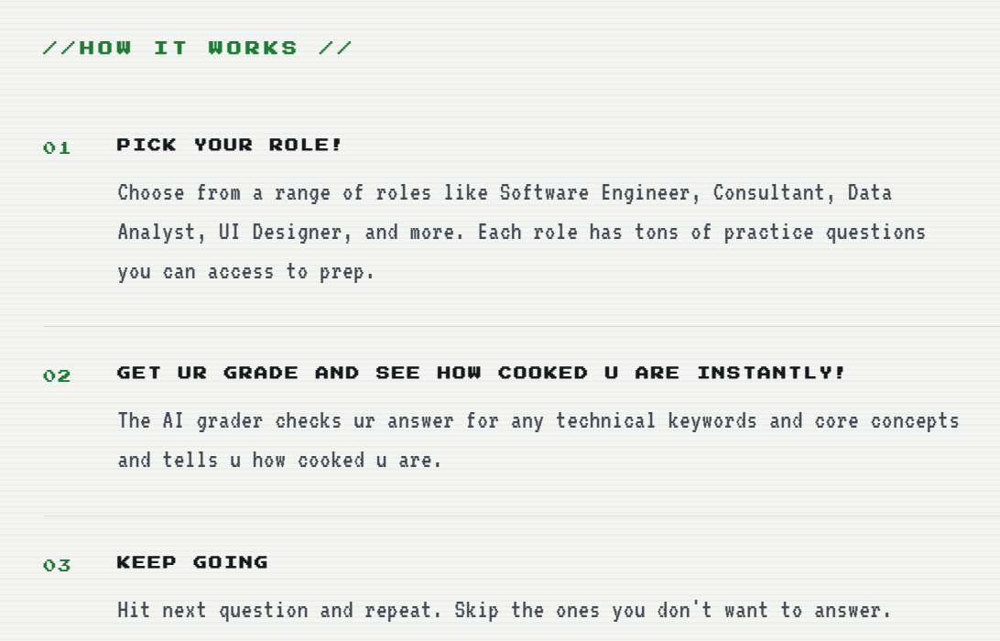
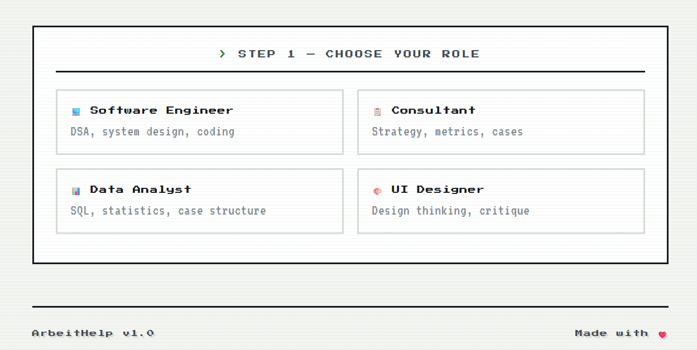
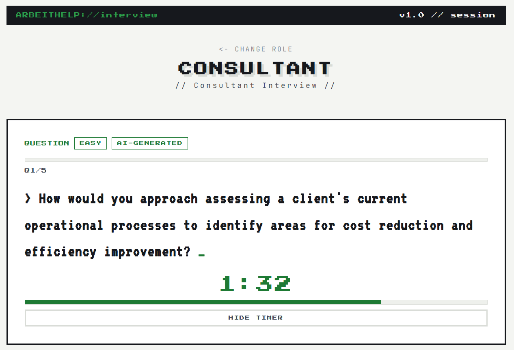
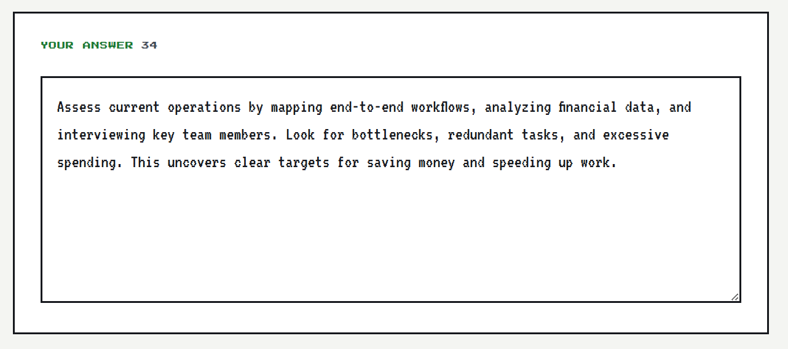
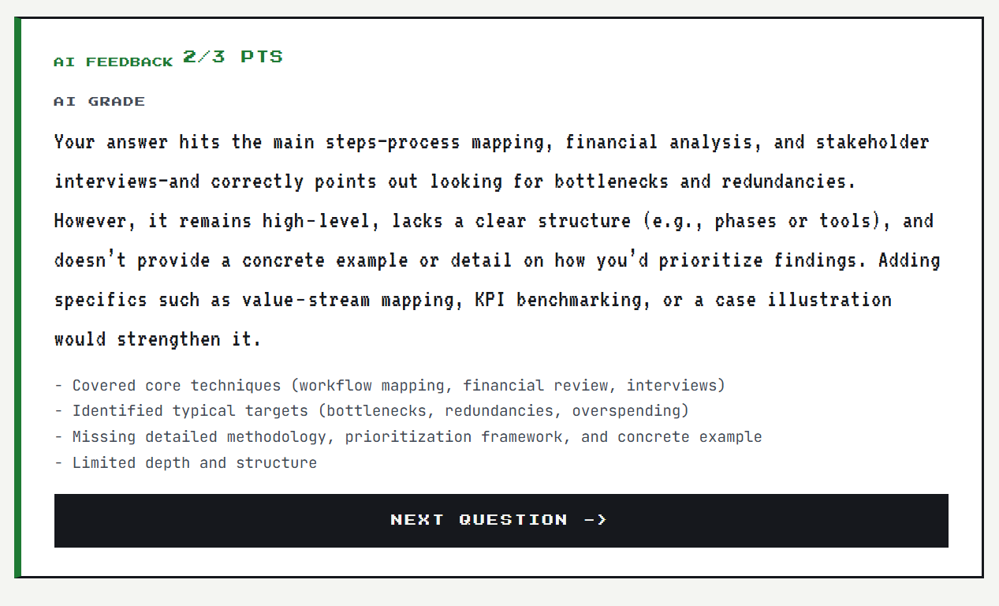
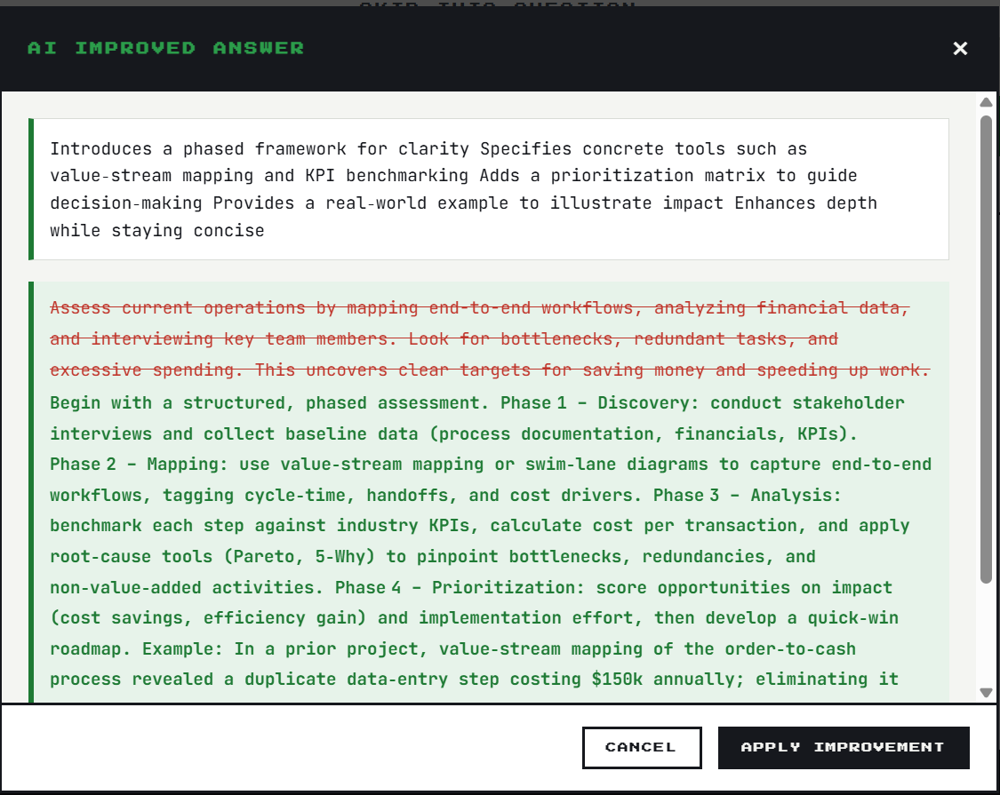
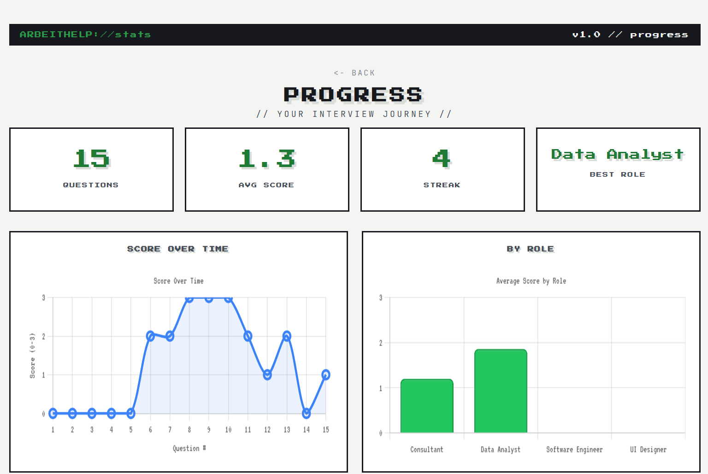
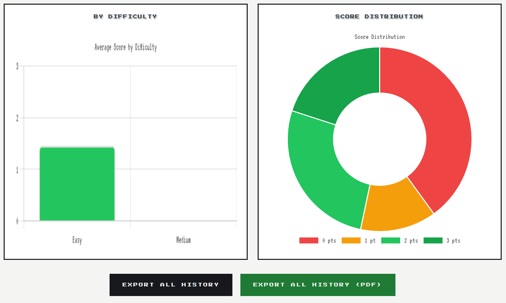

# ArbeitHelp

**AI-powered interview practice .**

ArbeitHelp is a free, open-source web app that helps you practice for job interviews. Pick a role, answer AI-generated questions, get graded instantly, and improve weak answers on the spot — all tracked in a personal stats dashboard.

<p align="center">
  
</p>

## Features

- **Choose your role** — practice interview questions tailored to Software Engineer, Consultant, Data Analyst, or UI Designer.
- **AI-generated questions** — questions are pulled from an AI model and span easy, medium, and hard difficulty.
- **Instant AI grading** — submit an answer and get a scores, along with a breakdown of what you covered and what you missed.
- **AI-improved answers** — not happy with your answer? Ask the AI to rewrite and strengthen it (with a before/after diff) so you learn as you go.
- **Timed questions** — each question comes with a countdown timer to simulate real interview pressure.
- **Skip & repeat** — skip questions you don't want to answer and move on to the next.
- **Stats dashboard** — see a summary report of how you performed across a session, and export your results as JSON or PDF.
- **Accounts & sessions** — simple email/password auth (JWT-based) so your progress is saved between sessions.

## How it works

1. **Pick your role** — choose from Software Engineer, Consultant, Data Analyst, UI Designer, and more.
2. **Answer & get graded** — the AI grader checks your answer for technical keywords and core concepts and scores it instantly.
3. **Keep going** — hit next question and repeat, or skip the ones you don't want to answer.

   <p align="center">


</p>

<p align="center">
  
</p>

## Tech stack

- **Backend:** Python, [Flask](https://flask.palletsprojects.com/)
- **Database:** SQLite
- **Auth:** JWT (PyJWT)
- **AI provider:** [Groq](https://groq.com/) (default model: `openai/gpt-oss-120b`)
- **PDF export:** fpdf2
- **Frontend:** plain HTML, CSS, and JavaScript (no framework)
- **Server:** gunicorn (production)
- **Testing:** pytest

## Getting started

### Prerequisites

- Python 3.12+
- A [Groq API key](https://console.groq.com/) (optional — the app can run with AI disabled and fall back to a static question bank)

### Installation

```bash
# Clone the repo
git clone https://github.com/<your-username>/ArbeitHelp.git
cd ArbeitHelp
 
# Create a virtual environment
python3 -m venv venv
source venv/bin/activate   # Windows: venv\Scripts\activate
 
# Install dependencies
pip install -r requirements.txt
```

### Configuration

Copy the example environment file and fill in your values:

```bash
cp .env.example .env
```

| Variable         | Description                                               | Default                 |
| ---------------- | --------------------------------------------------------- | ----------------------- |
| `GROQ_API_KEY` | Your Groq API key (required for live AI features)         | —                      |
| `GROQ_MODEL`   | Groq model used for question generation and grading       | `openai/gpt-oss-120b` |
| `AI_ENABLED`   | Set to`true` to enable AI features                      | `false`               |
| `AI_TIMEOUT`   | Timeout (seconds) for AI requests                         | `30`                  |
| `JWT_SECRET`   | Secret used to sign auth tokens (auto-generated if unset) | —                      |

### Run locally

```bash
python app.py
```

The app will be available at `http://localhost:5050`.

For production, run it behind gunicorn:

```bash
gunicorn app:app
```

### Run tests

```bash
pytest
```

## Project structure

```
ArbeitHelp/
├── app.py                  # Flask app & API routes
├── ai_teacher.py           # AI question generation, grading, and answer improvement
├── config.py                # App configuration
├── data/
│   ├── questions.json      # Fallback question bank
│   └── app_data.sqlite3    # SQLite database (users, sessions, attempts)
├── prompts/                 # System & question-generator prompts for the AI
├── static/                  # Frontend (HTML/CSS/JS)
├── tests/                   # Pytest test suite
└── requirements.txt
```

## Screenshots

**1. Get a question for your chosen role**

<p align="center">
  
</p>

**2. Write your answer**

<p align="center">
  
</p>

**3. Get instant AI feedback and a grade**

<p align="center">
  
</p>

**4. Ask the AI to improve your answer and see a before/after diff**

<p align="center">
  
</p>

## Stats & progress dashboard

Once you finish a session, ArbeitHelp shows you a full progress report: total questions answered, average score, current streak, and your best-performing role, alongside charts for score over time, average score by role, average score by difficulty, and your overall score distribution. You can export your complete history as JSON or PDF at any time.

</p align="center">
  
</p>

<p align="center">
  
</p>

## Roadmap ideas

- More roles and question categories
- Difficulty selection / adaptive difficulty
- Richer stats & progress tracking over time

## Contributing

Issues and pull requests are welcome! If you have ideas for new roles, question types, or features, feel free to open an issue.

## License

This project is open source and free to use.

---
